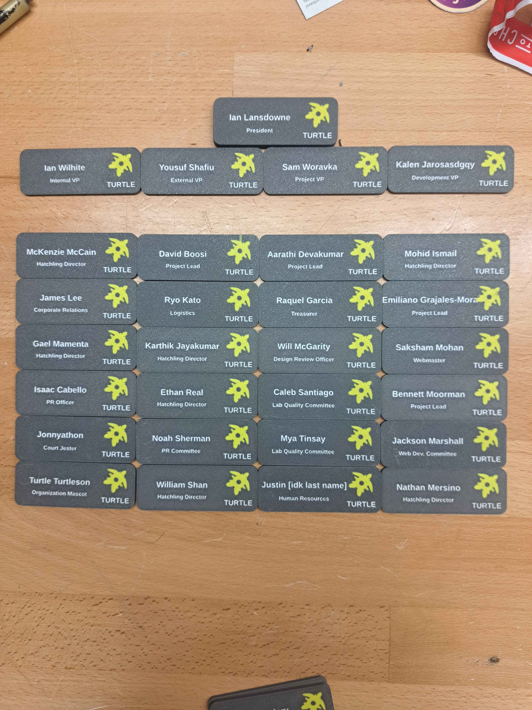

# TURTLE Nametag Generator
Generate multi-material nametags from a CSV roster using OpenSCAD.

<p align="center">
  
  
</p>

## How it works
The pipeline runs in three stages:
1. **STL Generation**: Read `data/names_roster.csv` and call OpenSCAD to export three aligned STLs per person: backing, text, and logo.
2. **STEP Conversion** (optional): Combine the three STLs into a single multi-body STEP file using cadquery-ocp.
3. **3MF Conversion** (optional): Merge the three STLs into a single 3MF file using PrusaSlicer CLI.

## Repo layout
- `scad/Turtle_nametag.scad`: Parametric nametag model and logo projection.
- `data/names_roster.csv`: Input roster (`role,name,email,username[,org]`).
- `scripts/generate_nametag_stls.py`: CSV → `<id>_backing.stl`, `<id>_text.stl`, `<id>_logo.stl` in `output/`.
- `scripts/stls_to_step.py`: Converts STL triplets to a single multi-body STEP file.
- `scripts/batch_stls_to_step.sh`: Batch wrapper for STEP conversion.
- `scripts/batch_stls_to_3mf.sh`: Batch wrapper for 3MF conversion using PrusaSlicer.
- `scripts/run_pipeline.sh`: Runs the full 3-step pipeline.

## Requirements
- OpenSCAD 2021+ (CLI available as `openscad`)
- Python 3.9+ (standard library only for STL generation)
- Bash (for the batch helper)
- Optional for STEP export: `cadquery-ocp` installed in `occ-venv`
- Optional for 3MF export: PrusaSlicer CLI in PATH (`prusa-slicer`, `prusaslicer`, or `PrusaSlicer`)

## Input CSV
 - `data/names_roster.csv` needs headers and one person per line:
```
role,name,email,username[,org]
Internal VP,Ian Wilhite,ian.wilhite0@tamu.edu,en._.ig
Finance Officer,Eddy Silva,esilva@tamu.edu,.halfnote
```

## Full pipeline (STL + STEP + 3MF)
From the repo root:
```bash
./scripts/run_pipeline.sh
```
This runs all three stages:
1. Activates `occ-venv` and generates STLs from the roster.
2. Converts STLs to STEP files (if `cadquery-ocp` is installed).
3. Converts STLs to 3MF files (if PrusaSlicer CLI is available).

All output files are written to `output/`:
- `<id>_backing.stl`, `<id>_text.stl`, `<id>_logo.stl` — individual part STLs
- `<id>.step` — combined multi-body STEP file
- `<id>.3mf` — combined 3MF file (ready for slicing)

If no STLs are produced (e.g., empty CSV or missing name/role), the script exits before conversion steps.

### Enabling optional outputs
- **STEP**: `source occ-venv/bin/activate && pip install cadquery-ocp`
- **3MF**: Install PrusaSlicer and ensure it's in your PATH

## Slicer usage
- **3MF method (recommended):** Import the `.3mf` file directly—parts are pre-merged and aligned.
- **3-STL method:** Import the three STLs as a multipart object; they share an origin and remain aligned.

Good luck and lmk if you have questions :) -I[2]
